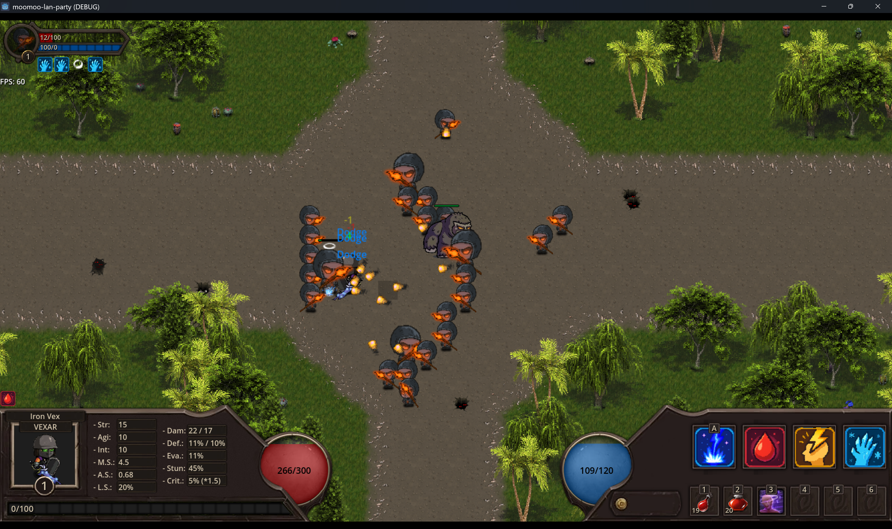
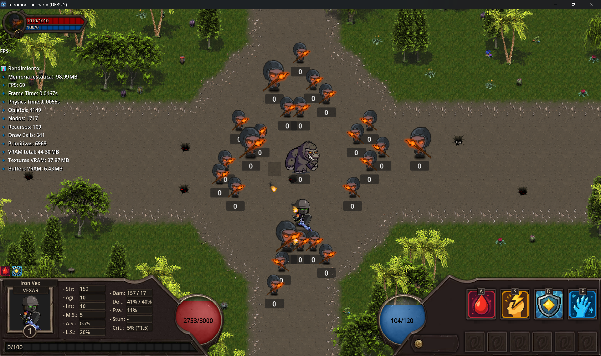
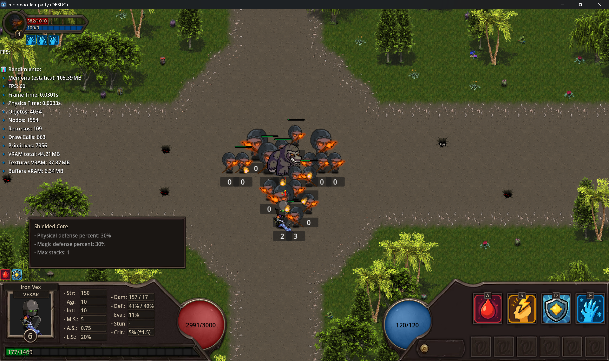
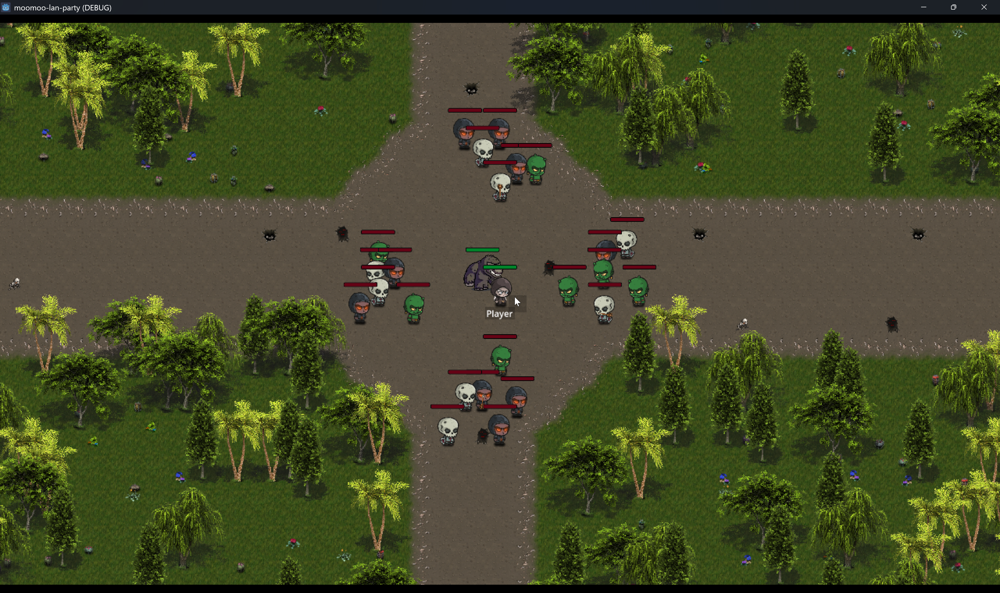
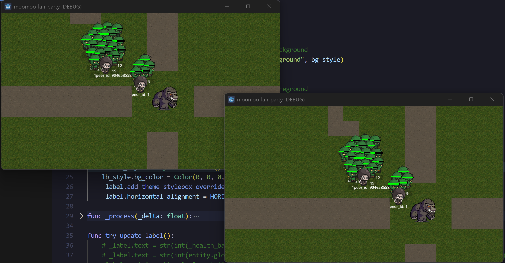
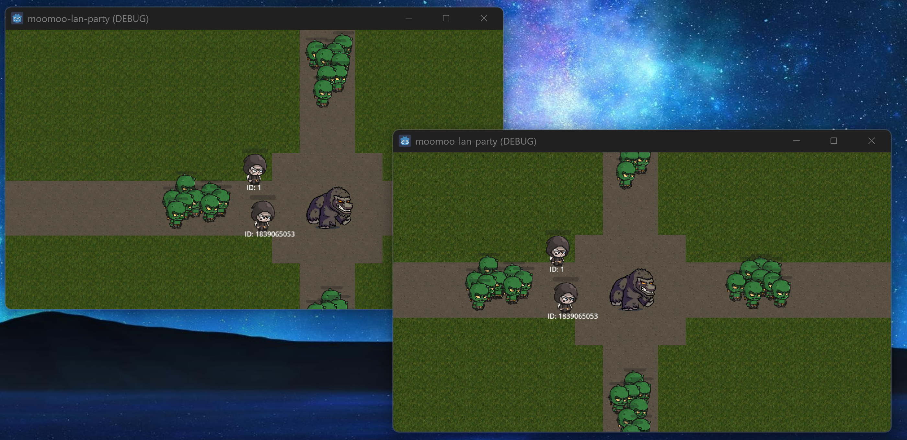
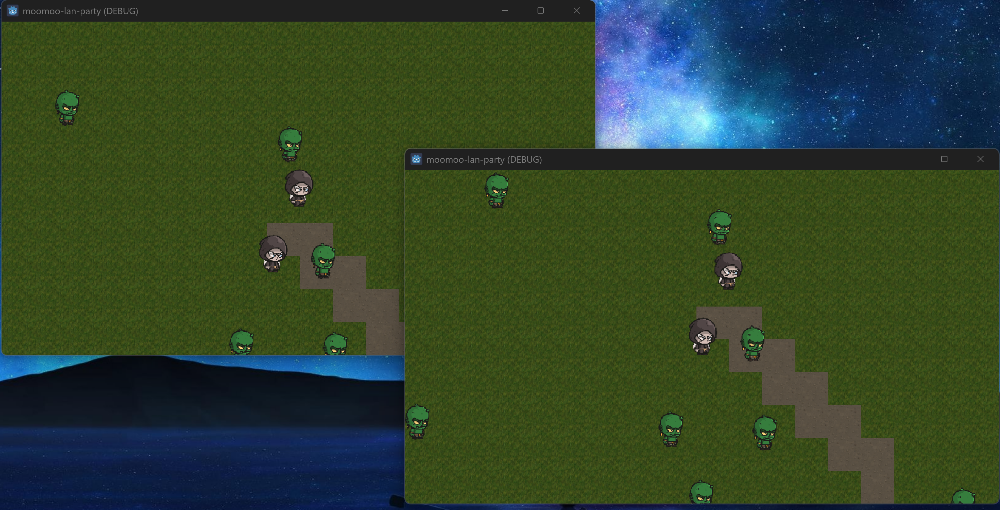
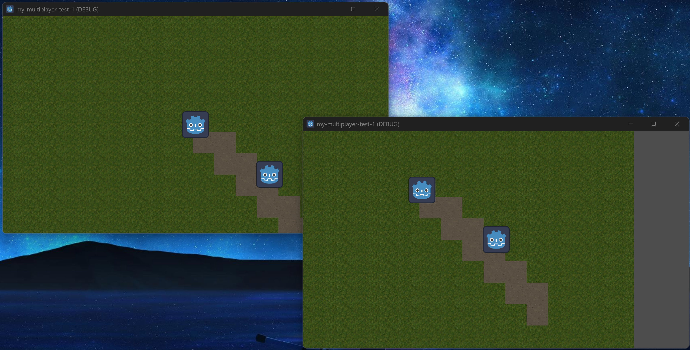

# MooMoo LAN Party 🐮

Welcome to **MooMoo LAN Party**, a free and open-source multiplayer game inspired by the legendary _Moo Moo_ map from Warcraft III. This game is designed to be played over a local network (LAN), offering fast-paced cooperative action where teamwork and strategy are key to survival.
[Moo Moo youtube video](https://www.youtube.com/watch?v=JKrPTaYtr-A)

## 🕹️ About the Game

In _MooMoo LAN Party_, each player selects a hero from a wide roster, each with four unique abilities and an ultimate — much like in Dota. Together with friends, you must defend an ancient artifact located at the center of the map from increasingly difficult waves of enemy creatures.

Defeating enemies grants gold and experience. Players can level up to enhance their abilities and spend gold on powerful items to improve their survivability and impact on the battlefield. Strategy, synergy, and quick reflexes are essential as the waves intensify.

This project aims to recreate the spirit and fun of the original Warcraft III custom map, using the modern Godot 4.4 engine.

## 🚀 Features (Planned)

- Local multiplayer over LAN using Godot's networking.
- Cooperative wave-defense gameplay.
- Multiple heroes with upgradable abilities and unique playstyles.
- Experience and gold progression system.
- Item shop and inventory.
- Dynamic spell effects and visual polish.
- Cross-platform support and easy setup.

## 🧠 Built With

- [Godot Engine 4.4](https://godotengine.org/)
- GDScript

## 👐 Contributing

See also the [TODO list](TODO.md) for a breakdown of planned features and tasks.

We welcome contributions! Whether it's bug fixes, feature suggestions, new heroes, or gameplay ideas — feel free to fork the repo and submit a pull request.

1. Fork the project.
2. Create your feature branch: `git checkout -b feature/AmazingFeature`
3. Commit your changes: `git commit -m 'Add some AmazingFeature'`
4. Push to the branch: `git push origin feature/AmazingFeature`
5. Open a pull request.

## 📦 Getting Started

1. Download or clone the repository: [https://github.com/LucasJappert/moomoo-lan-party](https://github.com/LucasJappert/moomoo-lan-party)
2. Open the project with Godot 4.4.
3. Run the main scene.
4. Connect clients over the same LAN using IP and port.
5. Choose your hero and defend the ancient!

## 📃 License

This project is open-source and available under the MIT License. See [LICENSE](LICENSE) for details.

---

Built with ❤️ and cows by **Lucas Jappert** and the MooMoo LAN community.

## 🖼️ Development Progress

Below are screenshots and images showing the progress of MooMoo LAN Party over time. This section will be updated as new features and visuals are added.

### 📅 2024-06-18

- ✅ Add item that gives 20% chance to stun an enemy
- ✅ Enable camera movement by holding down the mouse wheel
- ✅ Fix item synchronization between clients. Remove the item when the quantity is 0.
- ✅ Add hp potion items (three levels, +1 restores 200 hp, +2 restores 500, and +3 restores 2000). Consider item synchronization.
- ✅ Implement maintain terrain with Q
- ✅ Check synchronization of effects on the target (solved with \_add_current_effects() method).
- ✅ Sync animations with RPC messages
- ✅ Add active skill of lightning and implement the necessary features in the skill slot (such as remaining time for use)
- ✅ Allow diagonal movements when possible
- ✅ Maintain an aspect ratio of 16:9
- ✅ Correct attack when changing target while already attacking another one
- ✅ Fix stuck movements when near Moomoo
- ✅ Fix object synchronization for clients that join the room.
- ✅ Remove basemana and basehp and move them to stats.
- ✅ Remove extends Node from CombatStats. Free unused objects. Significant memory improvement.
- ✅ Fix sprite on target panel
- ✅ Refactor spawn functions
- ✅ Check synchronization of sprite projectiles
- ✅ Move to_dict and from_dict to a helper
- ✅ Draw effects of my target
- ✅ Draw effects of my player
- ✅ Implement tooltip to show information when hovering over certain elements, such as skills.
- ✅ Update my player's avatar and the entities being attacked.
- ✅ Move and attack target when out of range doing nothing.
- ✅ Print FPS (drops below 60 when laptop is plugged in)
- ✅ Add target avatar at the top left
- ✅ Implement regeneration logic for health and mana
- ✅ Fix clicks outside grid
- ✅ Shift + click function to move to a tile
- ✅ Draw avatar in the left panel and the hero's name
- ✅ Fix sprite position in enemies
- ✅ Start logic for strength, agility, and intelligence attributes
- ✅ Set first hero types
- ✅ Start building ingame UI
- ✅ Start implementing experience and leveling logic
- ✅ Set sprites by code in heroes
- ✅ Sync Moomoo
- ✅ Start drawing the 4 abilities on the bottom bar
- ✅ Start showing my player stats
- ✅ Move towards target when player wants to attack an enemy but is out of range.

### 📅 2024-06-13

- ✅ Implement camera movement with mouse (not fixed to player)
- ✅ Move towards target when player wants to attack an enemy but is out of range.
- ✅ Add life-stealing skill.
- ✅ Implement skills in enemies (also useful for heroes later)
- ✅ Set sprites by code in heroes
- ✅ Sync Moomoo
- ✅ Start drawing the 4 abilities on the bottom bar
- ✅ Start showing my player stats
- ✅ Fix sprite position in enemies
- ✅ Draw avatar in the left panel and the hero's name
- ✅ Shift + click function to move to a tile
- ✅ Fix clicks outside grid
- ✅ Implement regeneration logic for health and mana
- ✅ Add target avatar at the top left
- ✅ Print FPS (drops below 60 when laptop is plugged in)
- ✅ Move and attack target when out of range doing nothing.
- ✅ Update my player's avatar and the entities being attacked.
- ✅ Implement tooltip to show information when hovering over certain elements, such as skills.
- ✅ Draw effects of my player
- ✅ Draw effects of my target
- ✅ Move to_dict and from_dict to a helper
- ✅ Check synchronization of sprite projectiles
- ✅ Refactor spawn functions
- ✅ Fix sprite on target panel
- ✅ Remove extends Node from CombatStats. Free unused objects. Significant memory improvement.
- ✅ Remove basemana and basehp and move them to stats.
- ✅ Fix object synchronization for clients that join the room.
- 🟡 Start implementing experience and leveling logic
- 🟡 Start building ingame UI
- 🟡 Set first hero types
- 🟡 Start logic for strength, agility, and intelligence attributes

### 📅 2024-05-21

- Major improvements in pathfinding using AStarGrid2D.
- Significant terrain design enhancements, adding trees and other decorations like cacti, plants, etc.
- Created our own health bar.
- Implemented the first stage of projectiles, currently arrows.
- Implemented the initial melee and ranged attack system, including attack logic between enemies and players.
- Created the first types of enemies.

### 📅 2024-05-15

- Improved pathfinding for all entities (Enemies, Player).

### 📅 2024-05-09

- Add Entity reusable class (implemented on Enemies at the moment, rest to use it in Player).
- Improve pathfinding on Enemies.
- Use right click to move hte player.
- Add HUD to Entity (health bar, label).

### 📅 2024-05-03

- Sort all nodes (enemies, players, Moomoo) by Y position.
- Implement wave-based enemy spawning system.
- Add Moomoo.
- Zoom in and out using the mouse wheel.

### 📅 2024-05-03

- Add first enemies and update some assets.

### 📅 2024-05-01

- Initial player movement and LAN connection working!

---

To add new screenshots, simply place them in the `.images/` folder and update this section with the date and a short description.
