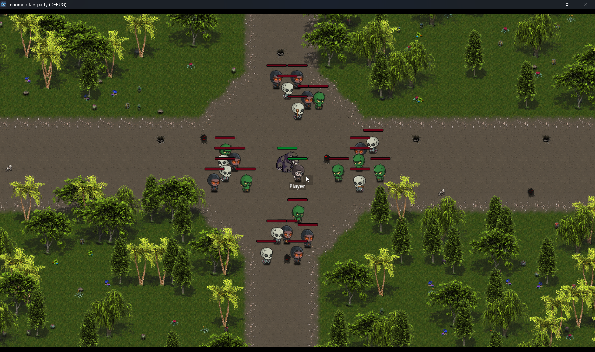
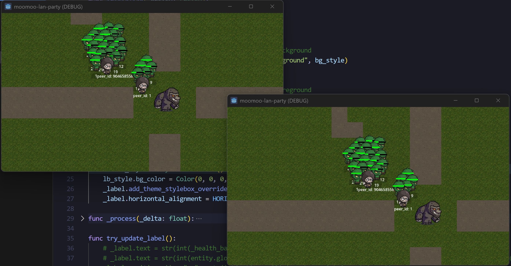
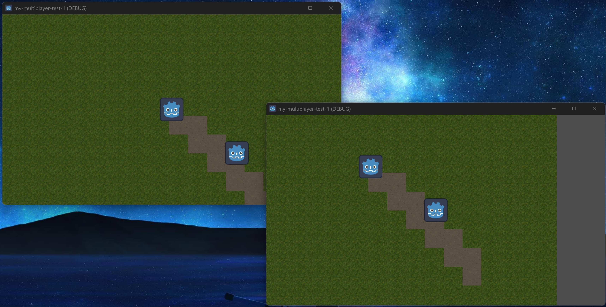

# MooMoo LAN Party 🐮

Welcome to **MooMoo LAN Party**, a free and open-source multiplayer game inspired by the legendary _Moo Moo_ map from Warcraft III. This game is designed to be played over a local network (LAN), offering fast-paced cooperative action where teamwork and strategy are key to survival.
[Moo Moo youtube video](https://www.youtube.com/watch?v=JKrPTaYtr-A)

## 🕹️ About the Game

In _MooMoo LAN Party_, each player selects a hero from a wide roster, each with four unique abilities and an ultimate — much like in Dota. Together with friends, you must defend an ancient artifact located at the center of the map from increasingly difficult waves of enemy creatures.

Defeating enemies grants gold and experience. Players can level up to enhance their abilities and spend gold on powerful items to improve their survivability and impact on the battlefield. Strategy, synergy, and quick reflexes are essential as the waves intensify.

This project aims to recreate the spirit and fun of the original Warcraft III custom map, using the modern Godot 4.4 engine.

## 🚀 Features (Planned)

- Local multiplayer over LAN using Godot's networking.
- Cooperative wave-defense gameplay.
- Multiple heroes with upgradable abilities and unique playstyles.
- Experience and gold progression system.
- Item shop and inventory.
- Dynamic spell effects and visual polish.
- Cross-platform support and easy setup.

## 🧠 Built With

- [Godot Engine 4.4](https://godotengine.org/)
- GDScript

## 👐 Contributing

See also the [TODO list](TODO.md) for a breakdown of planned features and tasks.

We welcome contributions! Whether it's bug fixes, feature suggestions, new heroes, or gameplay ideas — feel free to fork the repo and submit a pull request.

1. Fork the project.
2. Create your feature branch: `git checkout -b feature/AmazingFeature`
3. Commit your changes: `git commit -m 'Add some AmazingFeature'`
4. Push to the branch: `git push origin feature/AmazingFeature`
5. Open a pull request.

## 📦 Getting Started

1. Download or clone the repository: [https://github.com/LucasJappert/moomoo-lan-party](https://github.com/LucasJappert/moomoo-lan-party)
2. Open the project with Godot 4.4.
3. Run the main scene.
4. Connect clients over the same LAN using IP and port.
5. Choose your hero and defend the ancient!

## 📃 License

This project is open-source and available under the MIT License. See [LICENSE](LICENSE) for details.

---

Built with ❤️ and cows by **Lucas Jappert** and the MooMoo LAN community.

## 🖼️ Development Progress

Below are screenshots and images showing the progress of MooMoo LAN Party over time. This section will be updated as new features and visuals are added.

### 📅 2024-05-21

- Major improvements in pathfinding using AStarGrid2D.
- Significant terrain design enhancements, adding trees and other decorations like cacti, plants, etc.
- Created our own health bar.
- Implemented the first stage of projectiles, currently arrows.
- Implemented the initial melee and ranged attack system, including attack logic between enemies and players.
- Created the first types of enemies.

### 📅 2024-05-15

- Improved pathfinding for all entities (Enemies, Player).

### 📅 2024-05-09

- Add Entity reusable class (implemented on Enemies at the moment, rest to use it in Player).
- Improve pathfinding on Enemies.
- Use right click to move hte player.
- Add HUD to Entity (health bar, label).

### 📅 2024-05-03

- Sort all nodes (enemies, players, Moomoo) by Y position.
- Implement wave-based enemy spawning system.
- Add Moomoo.
- Zoom in and out using the mouse wheel.

### 📅 2024-05-03

- Add first enemies and update some assets.

### 📅 2024-05-01

- Initial player movement and LAN connection working!

---

To add new screenshots, simply place them in the `.images/` folder and update this section with the date and a short description.
